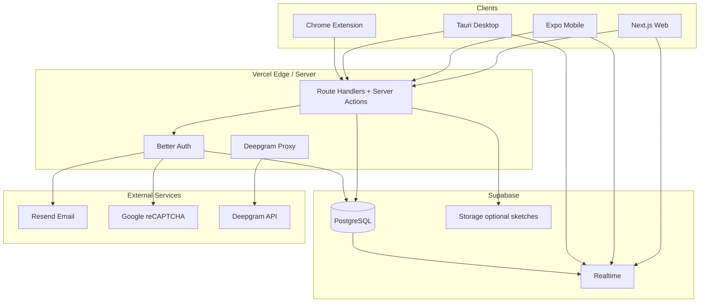
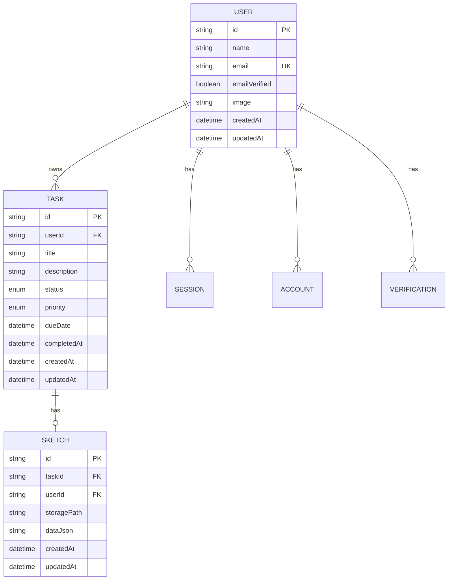
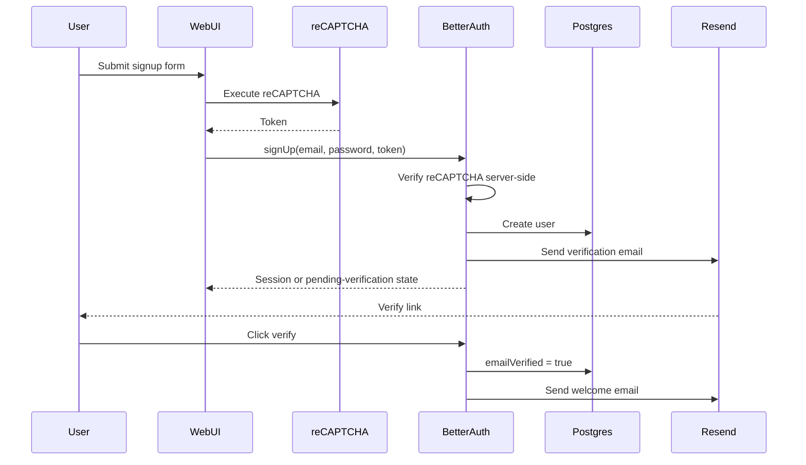
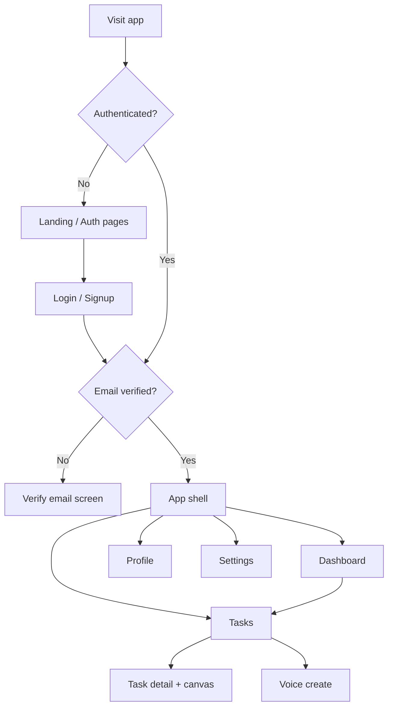
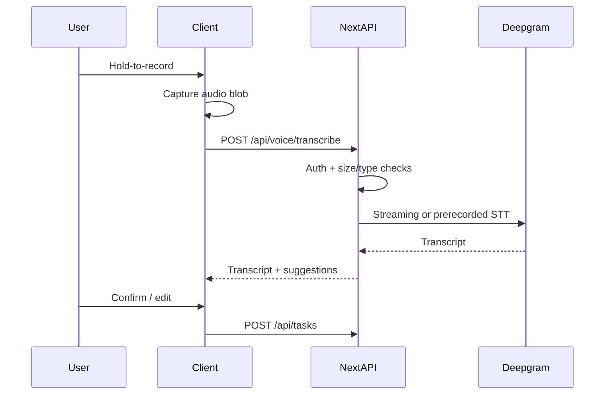

# TaskFlow — Project Plan

> **Single source of truth** for architecture, product scope, and phase-by-phase delivery.
> No implementation lives in this document — only planning sufficient to build without redesign.

---

## Table of Contents

1. [Project Overview](#1-project-overview)
2. [Project Vision](#2-project-vision)
3. [Project Goals](#3-project-goals)
4. [Tech Stack](#4-tech-stack)
5. [High-Level Architecture](#5-high-level-architecture)
6. [Monorepo Structure](#6-monorepo-structure)
7. [Folder Structure](#7-folder-structure)
8. [Database Design](#8-database-design)
9. [Prisma Schema Planning](#9-prisma-schema-planning)
10. [Authentication Flow](#10-authentication-flow)
11. [User Journey](#11-user-journey)
12. [Application Flow](#12-application-flow)
13. [Routing Strategy](#13-routing-strategy)
14. [API Design](#14-api-design)
15. [Realtime Strategy](#15-realtime-strategy)
16. [AI Integration (Deepgram)](#16-ai-integration-deepgram)
17. [HTML Canvas Strategy](#17-html-canvas-strategy)
18. [Chrome Extension Plan](#18-chrome-extension-plan)
19. [Mobile Application (Expo React Native)](#19-mobile-application-expo-react-native)
20. [Desktop Application (Tauri)](#20-desktop-application-tauri)
21. [UI / UX Planning](#21-ui--ux-planning)
22. [Component Inventory](#22-component-inventory)
23. [Design System](#23-design-system)
24. [State Management Strategy](#24-state-management-strategy)
25. [Environment Variables](#25-environment-variables)
26. [Error Handling Strategy](#26-error-handling-strategy)
27. [Security Checklist](#27-security-checklist)
28. [Performance Strategy](#28-performance-strategy)
29. [Deployment Strategy](#29-deployment-strategy)
30. [Testing Strategy](#30-testing-strategy)
31. [Loom Demonstration Checklist](#31-loom-demonstration-checklist)
32. [Future Improvements](#32-future-improvements)
33. [Architecture Decision Records (ADR)](#33-architecture-decision-records-adr)
34. [Development Phases](#34-development-phases)
35. [Coding Standards](#35-coding-standards)
36. [Documentation Standards](#36-documentation-standards)
37. [Development Principles](#37-development-principles)

---

## 1. Project Overview

**TaskFlow** is a modern, AI-powered, cross-platform task management application built for the Dafi Labs MERN Stack Internship Session 2 Weekly Assignment.

It demonstrates production engineering practices across:

| Surface | Technology |
| --- | --- |
| Web | Next.js (App Router) on Vercel |
| Mobile | Expo React Native |
| Desktop | Tauri |
| Browser | Chrome Extension (Manifest V3) |
| Backend | Next.js Route Handlers + Server Actions |
| Data | Supabase PostgreSQL + Prisma |
| Auth | Better Auth + Resend + Google reCAPTCHA |
| AI | Deepgram Speech-to-Text |
| Realtime | Supabase Realtime |

The product stays **intentionally simple**: create, organize, and complete tasks with search, filters, stats, voice capture, sketch annotations, and live sync — while sharing one backend, one database, and one auth system across all clients.

---

## 2. Project Vision

Deliver a polished SaaS-style task workspace that feels cohesive on web, mobile, desktop, and browser extension — proving that a single monorepo and shared API can power a multi-surface product without unnecessary complexity.

TaskFlow should feel:

- Fast and calm for daily task management
- Trustworthy for authentication and email flows
- Modern through theme support, motion, and responsive layout
- Extensible so future AI and collaboration features fit the same architecture

---

## 3. Project Goals

### Product goals

- [ ] Authenticated users can manage personal tasks end-to-end (CRUD)
- [ ] Email verification and welcome emails work in production
- [ ] reCAPTCHA protects public auth endpoints
- [ ] Dashboard shows statistics, search, and filtering
- [ ] Voice input creates tasks via Deepgram
- [ ] Canvas sketches attach to tasks
- [ ] Realtime updates reflect task changes across open clients
- [ ] Chrome extension, Expo mobile, and Tauri desktop reuse the same API

### Engineering goals

- [ ] Strict TypeScript monorepo with shared types, validation, and utils
- [ ] Production-ready security, error handling, and env management
- [ ] Deployed web app on Vercel with a public GitHub repository
- [ ] Phase-based delivery that maps cleanly to assignment demos

### Non-goals (v1)

- Multi-user workspaces / team collaboration
- Native push notification infrastructure beyond Expo basics
- Offline-first CRDT sync
- Billing / subscriptions
- Native iOS App Store / Play Store release pipelines beyond Expo development builds

---

## 4. Tech Stack

### Frontend (Web)

| Concern | Choice |
| --- | --- |
| Framework | Next.js (latest stable), React 19, App Router |
| Language | TypeScript (strict) |
| Styling | Tailwind CSS v4 |
| Components | shadcn/ui + Radix UI |
| Icons | Lucide React |
| Motion | Framer Motion |
| Theming | next-themes (light / dark / system) |
| Forms | React Hook Form + Zod |

### Backend

| Concern | Choice |
| --- | --- |
| API | Next.js Route Handlers (`app/api`) |
| Mutations (web-preferred) | Server Actions where session-bound and form-driven |
| Validation | Zod (shared package) |
| Email | Resend |
| Bot protection | Google reCAPTCHA v3 |

### Data

| Concern | Choice |
| --- | --- |
| Database | Supabase PostgreSQL (single project) |
| ORM | Prisma |
| Realtime | Supabase Realtime (postgres_changes + presence where useful) |

### Auth

| Concern | Choice |
| --- | --- |
| Auth library | Better Auth |
| Session model | Cookie-based sessions for web; bearer/token strategy for mobile/extension/desktop as supported by Better Auth |
| Email flows | Verification + welcome via Resend |

### AI

| Concern | Choice |
| --- | --- |
| Speech-to-text | Deepgram (Nova model family) |
| Integration pattern | Client records audio → server proxies to Deepgram → transcript → task draft |

### Clients

| Client | Choice |
| --- | --- |
| Mobile | React Native + Expo (latest) + Expo Router |
| Desktop | Tauri (webview loads web app or thin shell around shared API) |
| Extension | Chrome Manifest V3 |

### Tooling & deploy

| Concern | Choice |
| --- | --- |
| Monorepo | pnpm workspaces + Turborepo |
| Web deploy | Vercel |
| Repo | Public GitHub |

---

## 5. High-Level Architecture



### Architectural principles

1. **One backend of record** — all clients call the Next.js API (or Better Auth endpoints hosted there).
2. **One database** — Supabase PostgreSQL accessed primarily through Prisma on the server.
3. **Realtime as enhancement** — CRUD remains correct without realtime; realtime keeps UIs live.
4. **Shared packages** — types, Zod schemas, and pure utils live in `packages/*`.
5. **Secrets stay server-side** — Deepgram, Resend, database URLs never ship to clients.

### Request path (typical task mutation)

1. Authenticated client sends validated payload.
2. Route Handler / Server Action verifies session and ownership.
3. Zod validates input.
4. Prisma writes to PostgreSQL.
5. Supabase Realtime notifies subscribed clients.
6. Response returns updated entity / list snapshot.

---

## 6. Monorepo Structure

```text
TaskFlow/
├── apps/
│   ├── web/                 # Next.js web + API host
│   ├── mobile/              # Expo React Native
│   ├── desktop/             # Tauri shell
│   └── extension/           # Chrome MV3 extension
├── packages/
│   ├── ui/                  # Shared web UI primitives (optional reuse in desktop webview)
│   ├── types/               # Shared TypeScript domain types
│   ├── utils/               # Pure helpers (dates, status labels, cn)
│   ├── validation/          # Zod schemas shared by API + clients
│   └── config/              # ESLint, TSConfig, Tailwind presets
├── docs/
│   ├── PLAN.md              # This document
│   └── PLAN-PROMPT.md
├── package.json
├── pnpm-workspace.yaml
├── turbo.json
└── README.md
```

### Package responsibilities

| Package | Responsibility |
| --- | --- |
| `@taskflow/types` | Domain types: `Task`, `UserPublic`, enums, API DTOs |
| `@taskflow/validation` | Zod schemas mirroring DTOs; single source for forms + API |
| `@taskflow/utils` | Pure functions only (no Node/React Native specifics) |
| `@taskflow/ui` | shadcn-based primitives for web (+ Tauri webview) |
| `@taskflow/config` | Shared tooling configs |

Mobile and extension **do not** import React DOM UI from `@taskflow/ui`; they import types/validation/utils only.

---

## 7. Folder Structure

### `apps/web` (App Router)

```text
apps/web/
├── app/
│   ├── (marketing)/
│   │   ├── page.tsx                 # Landing
│   │   └── layout.tsx
│   ├── (auth)/
│   │   ├── login/page.tsx
│   │   ├── signup/page.tsx
│   │   ├── forgot-password/page.tsx
│   │   ├── verify-email/page.tsx
│   │   └── layout.tsx
│   ├── (app)/
│   │   ├── dashboard/page.tsx
│   │   ├── tasks/page.tsx
│   │   ├── tasks/[id]/page.tsx
│   │   ├── profile/page.tsx
│   │   ├── settings/page.tsx
│   │   └── layout.tsx               # Authenticated shell
│   ├── api/
│   │   ├── auth/[...all]/route.ts   # Better Auth handler
│   │   ├── tasks/route.ts
│   │   ├── tasks/[id]/route.ts
│   │   ├── tasks/stats/route.ts
│   │   ├── voice/transcribe/route.ts
│   │   ├── sketches/route.ts
│   │   ├── sketches/[id]/route.ts
│   │   └── health/route.ts
│   ├── layout.tsx
│   └── globals.css
├── components/
│   ├── auth/
│   ├── dashboard/
│   ├── tasks/
│   ├── canvas/
│   ├── layout/
│   └── shared/
├── lib/
│   ├── auth.ts
│   ├── auth-client.ts
│   ├── prisma.ts
│   ├── supabase/
│   ├── deepgram.ts
│   ├── recaptcha.ts
│   ├── email.ts
│   └── constants.ts
├── actions/                         # Server Actions (task mutations where preferred)
├── hooks/
├── prisma/
│   ├── schema.prisma
│   └── migrations/
└── public/
```

### `apps/mobile`

```text
apps/mobile/
├── app/                             # Expo Router
│   ├── (auth)/
│   ├── (tabs)/
│   │   ├── index.tsx                # Dashboard
│   │   ├── tasks.tsx
│   │   ├── create.tsx
│   │   └── profile.tsx
│   └── _layout.tsx
├── components/
├── lib/
│   ├── api.ts
│   ├── auth.ts
│   └── realtime.ts
└── app.json
```

### `apps/desktop`

```text
apps/desktop/
├── src-tauri/
│   ├── tauri.conf.json
│   ├── Cargo.toml
│   └── src/main.rs
└── README.md                        # Shell loads production/staging web URL or local web
```

**Decision:** Tauri hosts a webview pointed at the deployed Next.js app (or local `apps/web` in development). Native capabilities are limited in v1 (window chrome, deep links optional). This avoids duplicating the entire UI while satisfying the desktop requirement.

### `apps/extension`

```text
apps/extension/
├── manifest.json                    # MV3
├── background/
│   └── service-worker.ts
├── popup/
│   ├── index.html
│   └── Popup.tsx
├── options/
├── content/                         # Optional page context capture later
└── lib/
    ├── api.ts
    └── auth.ts
```

---

## 8. Database Design

### Entities (conceptual)



### Task status & priority

| Field | Values |
| --- | --- |
| `status` | `TODO`, `IN_PROGRESS`, `DONE`, `ARCHIVED` |
| `priority` | `LOW`, `MEDIUM`, `HIGH`, `URGENT` |

### Ownership rules

- Every task and sketch belongs to exactly one user.
- All queries filter by `userId` from the authenticated session.
- Soft archive via `ARCHIVED` status; hard delete available from API.

### Indexes (planned)

- `Task(userId, status)`
- `Task(userId, createdAt DESC)`
- `Task(userId, dueDate)`
- `Task` full-text or `title` trigram later (v1: `ILIKE` / Prisma `contains`)
- Unique `User.email`

### Better Auth tables

Better Auth owns `user`, `session`, `account`, `verification` (exact names follow Better Auth Prisma schema). Application tables (`Task`, `Sketch`) reference `user.id`.

---

## 9. Prisma Schema Planning

> Descriptive only — no implementation file in this plan phase beyond naming and relations.

### Models (planned)

**User** (Better Auth compatible)

- `id`, `name`, `email`, `emailVerified`, `image`, `createdAt`, `updatedAt`
- Relations: `sessions`, `accounts`, `tasks`, `sketches`

**Session / Account / Verification**

- As required by Better Auth Prisma adapter

**Task**

- `id` (cuid/ulid)
- `userId` → User
- `title` (string, 1–200)
- `description` (text, optional)
- `status` (enum)
- `priority` (enum, default `MEDIUM`)
- `dueDate` (DateTime?, optional)
- `completedAt` (DateTime?, set when status → `DONE`)
- `createdAt`, `updatedAt`

**Sketch**

- `id`
- `taskId` → Task (1:1 preferred for v1; unique `taskId`)
- `userId` → User
- `storagePath` (optional PNG in Supabase Storage)
- `dataJson` (canvas stroke JSON for re-edit)
- `createdAt`, `updatedAt`

### Prisma practices

- Single `schema.prisma` under `apps/web/prisma` (API host owns migrations)
- Generate client consumed by web server only
- Migrations committed to git
- Never expose Prisma Client to browsers / mobile bundles

---

## 10. Authentication Flow

### Providers & mechanisms

| Mechanism | Purpose |
| --- | --- |
| Email + password | Primary signup / login |
| Better Auth sessions | Server-validated sessions |
| Resend | Verification + welcome + password reset emails |
| Google reCAPTCHA v3 | Score gate on signup / login / forgot-password |

### Signup flow



### Login flow

1. User submits credentials + reCAPTCHA token.
2. Server verifies captcha score threshold.
3. Better Auth validates credentials and creates session.
4. Web sets HTTP-only secure cookie.
5. Mobile / extension / desktop obtain session token via Better Auth client APIs and store in secure storage (Keychain/Keystore / `chrome.storage.session` / OS keychain where available).

### Email verification

- Unverified users can authenticate but are redirected to a verify gate for app routes (configurable).
- Verification links expire per Better Auth defaults.
- Resend templates: Verify Email, Welcome, Reset Password.

### Password reset

1. Forgot password page → email + reCAPTCHA.
2. Resend sends reset link.
3. User sets new password on reset page.
4. Sessions optionally invalidated on password change.

### Authorization model (v1)

- Authenticated user can only read/write own resources.
- No roles beyond `authenticated` / `anonymous`.
- Admin role deferred to future improvements.

---

## 11. User Journey

### Happy path (new user)

1. Lands on marketing page → understands TaskFlow value.
2. Signs up with email/password (passes reCAPTCHA).
3. Verifies email from inbox.
4. Receives welcome email.
5. Lands on dashboard with empty state + CTA.
6. Creates first task (form, voice, or extension).
7. Optionally sketches on canvas for that task.
8. Filters / searches tasks; marks complete; sees stats update.
9. Opens same account on mobile / desktop / extension; sees synced data (and live updates when online).

### Returning user

1. Login → dashboard.
2. Reviews stats and due soon.
3. Works tasks; realtime keeps other open clients fresh.
4. Adjusts theme / profile in settings.

### Recovery path

1. Forgot password → email link → reset → login.

---

## 12. Application Flow



### Server vs client boundaries (web)

| Concern | Rendering |
| --- | --- |
| Landing / SEO | Server Components |
| Auth pages | Client (forms, captcha, motion) |
| Dashboard stats | Server fetch + client realtime refresh |
| Task list | Server initial data + client interactions |
| Canvas | Client-only |
| Voice recorder | Client-only |
| Theme | Client (`next-themes`) |

---

## 13. Routing Strategy

### Web (`apps/web`)

| Route | Access | Purpose |
| --- | --- | --- |
| `/` | Public | Interactive demo dashboard (seed + localStorage; no DB). Signed-in verified users redirect to `/dashboard` |
| `/login` | Public | Login |
| `/signup` | Public | Signup |
| `/forgot-password` | Public | Request reset |
| `/reset-password` | Public | Complete reset |
| `/verify-email` | Auth | Verification instructions / status |
| `/dashboard` | Auth + verified | Personal workspace (Prisma) |
| `/tasks` | Auth + verified | Task list / management |
| `/tasks/[id]` | Auth + verified | Detail + canvas |
| `/profile` | Auth + verified | Profile |
| `/settings` | Auth + verified | Preferences / theme / account |

**Guards:** Next.js middleware checks session cookie for `(app)` group (`/dashboard`, `/tasks`, `/profile`, `/settings`); unverified users redirected to `/verify-email`. `/` stays public for guest demo mode.

### Mobile (Expo Router)

| Route | Purpose |
| --- | --- |
| `/(auth)/login`, `/(auth)/signup` | Auth |
| `/(tabs)/` | Dashboard, Tasks, Create, Profile |
| `/task/[id]` | Detail stack screen |

### Extension

| Surface | Purpose |
| --- | --- |
| Popup | Quick add task + recent list |
| Options | API base URL, auth status, logout |

### Desktop

Routes are the web routes inside the webview (same URLs as production web).

---

## 14. API Design

Base URL: `https://<web-domain>/api` (local: `http://localhost:3000/api`).

All endpoints (except auth public routes and health) require a valid session.

Validation: request bodies parsed with `@taskflow/validation` Zod schemas.
Errors: consistent JSON `{ error: { code, message, details? } }`.

### Health

| Method | Path | Description |
| --- | --- | --- |
| `GET` | `/api/health` | Liveness; returns `{ ok: true }` |

### Auth (Better Auth catch-all)

| Method | Path | Description |
| --- | --- | --- |
| `ALL` | `/api/auth/[...all]` | Better Auth handler (sign-up, sign-in, sign-out, session, verify, reset) |

Auth endpoints accept reCAPTCHA token in designated fields / headers for signup, login, and forgot-password; server verifies before proceeding.

### Tasks

| Method | Path | Description |
| --- | --- | --- |
| `GET` | `/api/tasks` | List tasks for current user. Query: `status`, `priority`, `q` (search), `from`, `to`, `page`, `pageSize`, `sort` |
| `POST` | `/api/tasks` | Create task. Body: `title`, `description?`, `status?`, `priority?`, `dueDate?` |
| `GET` | `/api/tasks/stats` | Aggregate counts: total, by status, by priority, completedThisWeek, overdue |
| `GET` | `/api/tasks/[id]` | Get one task (ownership enforced) |
| `PATCH` | `/api/tasks/[id]` | Partial update |
| `DELETE` | `/api/tasks/[id]` | Hard delete task (+ cascade sketch) |

### Voice

| Method | Path | Description |
| --- | --- | --- |
| `POST` | `/api/voice/transcribe` | Accept audio (`multipart/form-data`). Proxy to Deepgram. Return `{ transcript, suggestedTitle, suggestedDescription? }` |

Server may apply light post-processing (trim, first sentence → title). Client confirms before `POST /api/tasks`.

### Sketches (HTML Canvas)

| Method | Path | Description |
| --- | --- | --- |
| `GET` | `/api/sketches?taskId=` | Get sketch for task |
| `POST` | `/api/sketches` | Create/upsert sketch: `taskId`, `dataJson`, optional image blob |
| `PATCH` | `/api/sketches/[id]` | Update strokes / image |
| `DELETE` | `/api/sketches/[id]` | Delete sketch |

### Profile

| Method | Path | Description |
| --- | --- | --- |
| `GET` | `/api/profile` | Current user public profile |
| `PATCH` | `/api/profile` | Update `name`, `image` (URL) |

> Profile may alternatively use Better Auth account APIs; if so, document the chosen path in implementation README and keep this plan’s contract equivalent.

### Server Actions (web)

Prefer Server Actions for:

- Task create/update/delete from dashboard forms
- Profile name update
- Settings preference flags stored server-side (if any)

Keep Route Handlers for:

- Cross-platform clients (mobile, extension, desktop non-document requests)
- File uploads (audio, sketch PNG)
- Better Auth mount
- Health checks

---

## 15. Realtime Strategy

### Why Supabase Realtime

- Database already on Supabase PostgreSQL — realtime pairs naturally with `postgres_changes`.
- Avoids building a custom WebSocket server on Vercel (serverless is a poor fit for long-lived sockets).
- Clients subscribe directly to row changes filtered by `user_id`.

### What we subscribe to

| Channel pattern | Events | Purpose |
| --- | --- | --- |
| `tasks:user:{userId}` | INSERT/UPDATE/DELETE on `Task` | Live lists & stats refresh |
| `sketches:user:{userId}` | INSERT/UPDATE/DELETE on `Sketch` | Live canvas metadata (optional) |

### Connection lifecycle

1. Authenticated client obtains Supabase anon key + user JWT (or use Realtime auth aligned with project RLS policies).
2. Create single Supabase client per app session.
3. Subscribe after auth; unsubscribe on logout / route teardown.
4. Reconnect with exponential backoff on network drop.
5. On resume, refetch authoritative list via REST to heal missed events.

### Presence

- v1: optional presence on dashboard channel for “multi-device active” indicator (nice-to-have).
- Not required for core assignment demo.

### Broadcast

- Not primary for v1. Prefer `postgres_changes` so DB remains source of truth.
- Broadcast reserved for ephemeral UX (e.g., “voice transcription in progress”) if needed later.

### Database events

- Enable replication for `Task` and `Sketch` tables.
- RLS policies: users can only select their rows (required for safe client-side subscriptions).
- Prisma writes still go through the server with service role / direct DB URL; RLS protects realtime clients.

### Best practices

- Filter server-side (`filter: user_id=eq.{id}`) always.
- Keep payloads small; refetch detail on open.
- Debounce UI merges when bursts of updates arrive.
- Never put service-role keys in clients.

### Vercel considerations

- Web app on Vercel does **not** host the realtime socket server.
- Browser connects to Supabase Realtime endpoints directly.
- Serverless functions remain stateless request/response for CRUD and AI proxy.
- Avoid relying on in-memory state across invocations.

---

## 16. AI Integration (Deepgram)

### Purpose

Convert short voice notes into task drafts so users can capture work hands-free.

### Architecture



### User flow

1. User taps **Voice task** on dashboard / tasks / mobile create tab / extension (web first).
2. Records ≤ 60 seconds of audio.
3. Sees loading state while transcription runs.
4. Reviews suggested title (and optional description).
5. Saves as task or discards.

### Security

- Deepgram API key only on server (`DEEPGRAM_API_KEY`).
- Authenticated endpoint only; rate limit per user.
- Validate MIME type and max upload size.
- Do not log raw audio or full transcripts in production logs.
- Optional: strip PII from logs.

### Future enhancements

- Streaming partial transcripts in UI
- Intent parsing (“remind me tomorrow”) → due dates
- Multi-language detection
- Speaker diarization (not needed for personal tasks)

---

## 17. HTML Canvas Strategy

### Feature

**Task Sketch Pad** — an HTML Canvas editor on the task detail page where users draw freehand annotations (arrows, notes, quick diagrams) stored with the task.

### Purpose

- Satisfies the HTML Canvas assignment requirement with a product-relevant use case
- Helps users capture visual context that text titles miss

### User flow

1. Open `/tasks/[id]`.
2. Open **Sketch** panel.
3. Draw with pointer / touch; undo / clear / color / stroke width.
4. Save → `dataJson` persisted; optional PNG snapshot uploaded.
5. Thumbnail appears on task detail; editable later.

### Integration

| Layer | Plan |
| --- | --- |
| UI | Client component `TaskCanvas` using native canvas 2D |
| Data | `Sketch` row + optional Supabase Storage object |
| API | `/api/sketches` upsert |
| Mobile | v1 read-only image preview or “open on web”; edit on web first to limit scope |
| Realtime | Optional refresh when sketch updates from another device |

### Out of scope for v1

- Collaborative multi-cursor drawing
- Shape recognition / OCR on sketches
- Infinite whiteboard boards unrelated to tasks

---

## 18. Chrome Extension Plan

### Purpose

Capture tasks without leaving the current browser tab — quick add + glance at recent tasks.

### Architecture

- Manifest V3 service worker for auth session refresh / messaging
- React popup UI (Vite or extension bundler)
- Talks to TaskFlow API over HTTPS
- No privileged access to page DOM required for v1 (optional content script later for “save selection as task”)

### Features (v1)

- [ ] Login status indicator
- [ ] Quick-add task (title + priority)
- [ ] List recent 5 tasks
- [ ] Open task in web app
- [ ] Theme-aware popup styling (light/dark)

### Authentication

- Use Better Auth cookie domain strategy if extension shares site cookies (limited), **or**
- Explicit token login in popup stored in `chrome.storage.session`
- Preferred v1: email/password sign-in in popup → store session token securely → `Authorization` header on API calls

### Communication with web application

| Direction | Mechanism |
| --- | --- |
| Extension → API | REST (`/api/tasks`) |
| Extension → Web | `tabs.create` to dashboard / task URLs |
| Web → Extension | Not required in v1 |

---

## 19. Mobile Application (Expo React Native)

### Expo architecture

- Expo managed workflow
- Expo Router file-based navigation
- TypeScript strict
- Secure token storage via `expo-secure-store`
- API client wrapping shared Zod types

### Navigation strategy

```text
Root
├── (auth) stack — login / signup / forgot
└── (tabs)
    ├── Dashboard
    ├── Tasks
    ├── Create (form + voice)
    └── Profile
Task detail pushed on stack above tabs
```

### Shared backend

- Same Next.js API base URL
- Same Supabase project for realtime
- Same Better Auth user records

### Authentication

- Better Auth client flows adapted for React Native (bearer token / cookie polyfill per Better Auth RN guidance)
- Persist session in Secure Store
- Deep link for email verification opens Expo linking URL **or** instructs user to verify in browser (choose browser verify for simplicity in v1)

### API usage

- `GET/POST/PATCH/DELETE /api/tasks`
- `GET /api/tasks/stats`
- `POST /api/voice/transcribe` with recorded audio via `expo-av`
- Profile GET/PATCH

### Shared business logic

- Import `@taskflow/validation` and `@taskflow/types` and `@taskflow/utils`
- Do **not** share React DOM components

### Mobile UI scope (v1)

- Dashboard stats cards
- Task list with search/filter
- Create/edit/complete
- Voice create
- Profile + logout
- Light/dark via system appearance
- Canvas edit deferred to web; show sketch preview if image exists

---

## 20. Desktop Application (Tauri)

### Architecture

- Tauri 2.x shell
- Webview loads TaskFlow web app (env-configurable URL)
- OS window title: TaskFlow
- Optional: custom title bar styling later

### Shared backend

- Identical to web — desktop is a packaged browser surface over the same deployment

### Authentication

- Cookie/session works inside webview against the web origin
- Deep links for auth optional

### API usage

- None beyond what the web app already does
- No duplicate Rust business logic in v1

### Why this approach

- Meets “desktop application (Tauri)” requirement with minimal duplication
- Keeps one UI codebase for web + desktop chrome
- Still demonstrates Tauri packaging and release artifacts

### Future desktop-native enhancements

- System tray quick-add
- Global hotkey capture
- Local notifications for due tasks

---

## 21. UI / UX Planning

### Landing

- Brand-forward hero: **TaskFlow** as primary signal
- One headline, one supporting sentence, CTA group (Get started / Login)
- Atmospheric background (gradient/pattern — not flat white); avoid purple-default clichés
- Responsive; motion on hero CTA and subtle entrance

### Login

- Email, password, reCAPTCHA (invisible v3)
- Links: signup, forgot password
- Inline field errors; disabled submit while pending

### Signup

- Name, email, password, confirm password
- reCAPTCHA v3
- Success → verify email instructions

### Forgot Password

- Email field + captcha → success acknowledgment (do not leak whether email exists beyond generic message)

### Dashboard

- Greeting + date
- Statistics cards: Total, Todo, In Progress, Done, Overdue
- Shortcuts: New Task, Voice Task
- Recent tasks list
- Empty state illustration/copy when no tasks

### Task Management

- Search input
- Filters: status, priority, due date
- Sort controls
- Task rows with status badge, priority, due date
- Bulk none in v1 (keep simple)
- Detail page: edit fields + sketch canvas + delete

### Profile

- Avatar (URL or initials), name, email (read-only email)
- Member since

### Settings

- Theme: Light / Dark / System
- Sign out
- Optional: danger zone delete account (future)

---

## 22. Component Inventory

### Layout

- `AppShell`, `Sidebar`, `Topbar`, `MobileNav`, `PageHeader`, `ThemeToggle`

### Auth

- `LoginForm`, `SignupForm`, `ForgotPasswordForm`, `ResetPasswordForm`, `VerifyEmailPanel`, `RecaptchaProvider`

### Dashboard

- `StatsCard`, `StatsGrid`, `RecentTasks`, `QuickActions`, `EmptyDashboard`

### Tasks

- `TaskList`, `TaskRow`, `TaskForm`, `TaskFilters`, `TaskSearch`, `StatusBadge`, `PriorityBadge`, `TaskDetailHeader`, `DeleteTaskDialog`

### Canvas

- `TaskCanvas`, `CanvasToolbar`, `CanvasColorPicker`, `SketchThumbnail`

### Voice

- `VoiceRecorderButton`, `TranscriptReviewDialog`

### Shared

- `Button`, `Input`, `Textarea`, `Select`, `Dialog`, `DropdownMenu`, `Card` (interaction containers only), `Skeleton`, `Spinner`, `ErrorAlert`, `Toast`, `ConfirmDialog`

### Extension

- `PopupShell`, `QuickAddForm`, `RecentTaskList`

### Mobile-specific

- `StatTile`, `TaskListItem`, `FilterSheet`, `VoiceCaptureScreen`

---

## 23. Design System

### Visual direction

Calm productivity SaaS: deep teal primary on cool gray surfaces, charcoal text, crisp whites; dark mode uses ink navy surfaces with teal accents. Avoid purple-on-white, cream-serif terracotta, and broadsheet newspaper layouts.

### Color palette (CSS variables)

| Token | Light | Dark |
| --- | --- | --- |
| `--background` | `#F5F7FA` | `#0B1220` |
| `--foreground` | `#0F172A` | `#E8EEF7` |
| `--card` | `#FFFFFF` | `#121A2B` |
| `--primary` | `#0F766E` | `#2DD4BF` |
| `--primary-foreground` | `#FFFFFF` | `#042F2E` |
| `--muted` | `#E8EEF5` | `#1A2438` |
| `--muted-foreground` | `#64748B` | `#94A3B8` |
| `--destructive` | `#DC2626` | `#F87171` |
| `--border` | `#D7DEE8` | `#243247` |
| `--success` | `#159947` | `#34D399` |
| `--warning` | `#D97706` | `#FBBF24` |

### Typography

- Display / brand: **Sora**
- Body / UI: **IBM Plex Sans**
- Mono (timestamps, IDs): **IBM Plex Mono**
- Scale: `xs–3xl` with clear hierarchy; brand on landing is hero-level

### Spacing

- 4px base unit; common: 8, 12, 16, 24, 32, 48
- Page padding: 16 mobile / 24–32 desktop

### Border radius

- Controls: `8px`
- Panels: `12px`
- Avoid pill-everything; pills only for status chips if needed

### Shadows

- Soft single-layer elevation for interactive surfaces only
- No multi-layer neon glow

### Icons

- Lucide React exclusively on web
- `@expo/vector-icons` mapped to similar metaphors on mobile

### Animations

- Page section fade/slide (Framer Motion)
- Stats card stagger on dashboard load
- Button press / dialog presence transitions
- Prefer 150–300ms ease-out; respect `prefers-reduced-motion`

### Accessibility

- WCAG AA contrast for text/icons
- Focus rings visible on all interactive elements
- Forms with labels (not placeholder-only)
- Canvas tools keyboard-accessible where feasible
- `aria-live` for transcription status

---

## 24. State Management Strategy

| State type | Tool | Notes |
| --- | --- | --- |
| Server state | React Query (TanStack Query) on web/mobile + Server Components initial data | Cache tasks, stats; invalidate on mutations / realtime events |
| Client UI state | React `useState` / URL search params | Filters/search in URL for shareable web state |
| Form state | React Hook Form + Zod resolver | Auth + task forms |
| Theme state | `next-themes` (web), Appearance API (mobile) | Persisted |
| Session state | Better Auth client | Source of truth for auth |
| Ephemeral | Local component state | Canvas strokes before save, recorder blobs |

**No Redux / Zustand required for v1.** Add a tiny store only if cross-tree ephemeral state becomes painful.

---

## 25. Environment Variables

### `apps/web` (server)

| Variable | Purpose |
| --- | --- |
| `DATABASE_URL` | Prisma PostgreSQL connection (Supabase) |
| `DIRECT_URL` | Direct connection for migrations (if pooled) |
| `BETTER_AUTH_SECRET` | Auth encryption / signing |
| `BETTER_AUTH_URL` | Canonical app URL |
| `RESEND_API_KEY` | Transactional email |
| `EMAIL_FROM` | Sender address |
| `RECAPTCHA_SECRET_KEY` | Server-side captcha verify |
| `DEEPGRAM_API_KEY` | Speech-to-text |
| `SUPABASE_URL` | Supabase project URL |
| `SUPABASE_SERVICE_ROLE_KEY` | Server-only admin operations / storage |
| `SUPABASE_ANON_KEY` | Safe for realtime client config endpoints if needed |
| `BLOB_OR_STORAGE_BUCKET` | Sketch images bucket name |

### `apps/web` (public)

| Variable | Purpose |
| --- | --- |
| `NEXT_PUBLIC_APP_URL` | Canonical public URL |
| `NEXT_PUBLIC_RECAPTCHA_SITE_KEY` | reCAPTCHA v3 site key |
| `NEXT_PUBLIC_SUPABASE_URL` | Realtime client |
| `NEXT_PUBLIC_SUPABASE_ANON_KEY` | Realtime client |

### Mobile / extension / desktop

| Variable | Purpose |
| --- | --- |
| `EXPO_PUBLIC_API_URL` | API base |
| `EXPO_PUBLIC_SUPABASE_URL` | Realtime |
| `EXPO_PUBLIC_SUPABASE_ANON_KEY` | Realtime |
| `VITE_API_URL` / `EXTENSION_API_URL` | Extension API base |
| `TAURI_WEB_URL` | Desktop webview target |

Never commit `.env` files with secrets. Provide `.env.example` only.

---

## 26. Error Handling Strategy

| Domain | Strategy |
| --- | --- |
| Authentication | Map Better Auth errors to friendly messages; generic failures for invalid login; captcha failure distinct |
| Validation | Zod flatten → field errors for forms; `400` with `details` for API |
| API | Central `jsonError` helper; never leak stack traces in production |
| Database | Catch Prisma known errors (`P2002` unique, `P2025` not found); translate to 409/404 |
| Realtime | On channel error → toast + fallback polling/refetch once |
| AI services | Timeout, 413 for large audio, 502 for upstream Deepgram failures; user can retry |
| Network | Client retries (React Query) for idempotent GETs; mutations manual retry |

Logging: structured server logs with request id; redact emails partially and never log passwords/tokens/audio.

---

## 27. Security Checklist

- [ ] HTTP-only, Secure, SameSite cookies for web sessions
- [ ] CSRF protections aligned with Better Auth + same-site practices
- [ ] Authorization checks on every task/sketch mutation (ownership)
- [ ] Zod validation on all inputs
- [ ] Prisma parameterized queries (SQL injection mitigation)
- [ ] React automatic escaping; sanitize any future rich text
- [ ] reCAPTCHA on public auth endpoints
- [ ] Rate limiting on auth, voice, and task create (middleware or Upstash-style limiter)
- [ ] Secrets only in server env; scanned out of client bundles
- [ ] RLS enabled for realtime-exposed tables
- [ ] CORS restricted to known web / mobile / extension origins
- [ ] File upload MIME/size limits
- [ ] Dependency auditing in CI
- [ ] Security headers on Vercel (CSP carefully tuned for captcha/supabase)

---

## 28. Performance Strategy

- Prefer React Server Components for read-heavy dashboard shells
- Paginate task lists (default page size 20)
- Index hot columns (`userId`, `status`, `dueDate`)
- Image/sketch compression before upload
- Audio capped at 60s / size limit
- Dynamic import canvas and voice modules
- TanStack Query stale times tuned to realtime invalidation
- Font subsetting; avoid huge icon imports
- Lighthouse budgets: aim ≥ 90 performance on dashboard after auth (realistic stretch)

---

## 29. Deployment Strategy

### Web

1. Push to public GitHub repository
2. Import project in Vercel; root or `apps/web` as app directory (Turborepo-aware)
3. Configure env vars in Vercel project settings
4. Run Prisma migrate in CI/release (`prisma migrate deploy`)
5. Custom domain optional

### Supabase

1. Create project
2. Apply Prisma migrations
3. Configure RLS + replication for realtime
4. Create storage bucket for sketches

### Mobile

- Expo Go for development demos
- EAS Build optional for internship submission if time allows

### Desktop

- Local `tauri build` artifacts for demo (Windows `.msi` / `.exe`)
- Not required to auto-update in v1

### Extension

- Load unpacked for demo; Chrome Web Store publish out of scope

### Environments

| Env | Purpose |
| --- | --- |
| Local | Docker-less; Supabase cloud + local Next |
| Preview | Vercel preview deployments per PR |
| Production | Vercel production + production Supabase |

---

## 30. Testing Strategy

### Unit

- Zod schemas (`packages/validation`)
- Pure utils (date/overdue helpers)
- Selected reducers / transformers (transcript → title)

### Integration

- API route tests with mocked Prisma / auth session
- Auth happy paths in staging

### Manual

- Full auth email flows with real Resend
- CRUD matrix per status/priority
- Realtime with two browsers
- Voice transcription sample
- Canvas save/reload
- Extension quick-add
- Expo app against deployed API
- Tauri webview login session

### Cross-platform

| Check | Web | Extension | Mobile | Desktop |
| --- | --- | --- | --- | --- |
| Login | ✓ | ✓ | ✓ | ✓ |
| Create task | ✓ | ✓ | ✓ | ✓ |
| Stats reflect | ✓ | — | ✓ | ✓ |
| Realtime | ✓ | optional | ✓ | ✓ |
| Voice | ✓ | optional | ✓ | ✓ |
| Canvas edit | ✓ | — | preview | ✓ |

---

## 31. Loom Demonstration Checklist

Record a single walkthrough covering:

- [ ] Repository + monorepo structure overview
- [ ] Deployed Vercel URL
- [ ] Landing page + theme toggle
- [ ] Signup + reCAPTCHA mention
- [ ] Email verification inbox + welcome email
- [ ] Dashboard stats cards
- [ ] Task CRUD + search/filter
- [ ] Supabase Realtime (two windows)
- [ ] Deepgram voice task creation
- [ ] HTML Canvas sketch on a task
- [ ] Chrome extension quick-add
- [ ] Expo mobile screens (simulator or device)
- [ ] Tauri desktop window
- [ ] Brief architecture diagram / PLAN.md mention
- [ ] Close with public GitHub link

Target length: 8–12 minutes. Speak to requirements explicitly by name.

---

## 32. Future Improvements

- Team workspaces and shared boards
- Comments / activity timeline
- Recurring tasks and reminders (email or push)
- Full offline support with sync queue
- Native canvas editing on mobile
- Streaming Deepgram captions
- Browser extension “save selection” content script
- Tauri tray + global hotkey
- Audit log and admin console
- End-to-end Playwright suite in CI
- i18n

---

## 33. Architecture Decision Records (ADR)

### ADR-001 — Monorepo with pnpm + Turborepo

| | |
| --- | --- |
| **Decision** | Single monorepo for web, mobile, desktop, extension, and shared packages |
| **Why** | Shared types/validation; one PR can update API + clients; assignment surfaces stay aligned |
| **Alternatives** | Polyrepos; Nx |
| **Pros** | Atomic changes, simpler intern workflow, shared CI |
| **Cons** | Heavier repo; tooling learning curve |
| **Trade-offs** | Accept Turborepo complexity for consistency |

### ADR-002 — Next.js as sole API host

| | |
| --- | --- |
| **Decision** | All HTTP APIs live in `apps/web` Route Handlers |
| **Why** | One deployable backend on Vercel; matches MERN-ish internship stack evolution |
| **Alternatives** | Separate Express/Fastify service; Supabase Edge Functions only |
| **Pros** | Simpler ops; colocate server actions |
| **Cons** | Couples web deploy to API; cold starts |
| **Trade-offs** | Prefer simplicity over microservice purity |

### ADR-003 — Better Auth + Prisma + Supabase Postgres

| | |
| --- | --- |
| **Decision** | Better Auth for sessions/email flows; Prisma ORM on Supabase PostgreSQL |
| **Why** | Modern auth DX; Prisma fits typed monorepos; Supabase gives DB + Realtime |
| **Alternatives** | NextAuth/Auth.js; Supabase Auth only; Drizzle |
| **Pros** | Clear ownership of user tables; email customization via Resend |
| **Cons** | Must carefully align Better Auth schema + RLS for realtime |
| **Trade-offs** | More integration work than “Supabase Auth only,” better control |

### ADR-004 — Supabase Realtime instead of custom websockets

| | |
| --- | --- |
| **Decision** | Clients subscribe to Supabase `postgres_changes` |
| **Why** | Vercel serverless cannot host durable sockets well |
| **Alternatives** | Pusher; PartyKit; Socket.IO on a VPS |
| **Pros** | Managed; tied to DB truth |
| **Cons** | Requires RLS setup; another client SDK |
| **Trade-offs** | Extra Supabase config for less infra burden |

### ADR-005 — Deepgram via server proxy

| | |
| --- | --- |
| **Decision** | Browser/mobile send audio to Next.js; server calls Deepgram |
| **Why** | Protect API keys; unify auth and rate limits |
| **Alternatives** | Temporary client tokens; Whisper self-host |
| **Pros** | Secure, swappable STT provider |
| **Cons** | Extra latency hop; upload bandwidth |
| **Trade-offs** | Accept hop for security |

### ADR-006 — Tauri as webview shell

| | |
| --- | --- |
| **Decision** | Desktop app loads the web application in Tauri webview |
| **Why** | Avoid rewriting UI; still ships a desktop artifact |
| **Alternatives** | Fully native Tauri UI; Electron |
| **Pros** | Fast delivery; one design system |
| **Cons** | Limited OS integration in v1 |
| **Trade-offs** | Depth deferred to future improvements |

### ADR-007 — HTML Canvas as per-task sketch pad

| | |
| --- | --- |
| **Decision** | Canvas feature = sketch annotations on tasks |
| **Why** | Clear UX purpose; easy to demo; scoped storage model |
| **Alternatives** | Standalone whiteboard; signature-only pad; confetti canvas gimmick |
| **Pros** | Product-relevant; 1:1 `Sketch` relation |
| **Cons** | Mobile editing deferred |
| **Trade-offs** | Web-first editing keeps mobile scope sane |

### ADR-008 — Shared validation package

| | |
| --- | --- |
| **Decision** | Zod schemas in `@taskflow/validation` used by API and clients |
| **Why** | Prevent drift between forms and handlers |
| **Alternatives** | Duplicate schemas; OpenAPI codegen |
| **Pros** | Single contract |
| **Cons** | Package versioning discipline required |
| **Trade-offs** | Prefer monorepo workspace links over publishing |

---

## 34. Development Phases

### Phase 1 — Project Setup

| | |
| --- | --- |
| **Goal** | Bootstrappable monorepo with tooling and empty apps |
| **Deliverables** | pnpm workspaces, Turborepo, `apps/web` Next.js skeleton, shared packages scaffolding, `.env.example`, README |
| **Dependencies** | None |
| **Success criteria** | `pnpm install` + `pnpm dev --filter=web` runs; TypeScript project references resolve |
| **Risks** | Tailwind v4 / Next version mismatches — pin known-good versions |

### Phase 2 — Authentication

| | |
| --- | --- |
| **Goal** | Complete auth lifecycle with email + captcha |
| **Deliverables** | Better Auth, Prisma user tables, Resend templates, reCAPTCHA, auth pages, middleware guards |
| **Dependencies** | Phase 1, Supabase project, Resend domain, reCAPTCHA keys |
| **Success criteria** | Signup → verify → welcome → login → logout works on deployed preview |
| **Risks** | Email deliverability; Better Auth schema migrations |

### Phase 3 — Dashboard

| | |
| --- | --- |
| **Goal** | Authenticated SaaS home with stats and shell UI |
| **Deliverables** | App shell, theme toggle, stats cards UI (wired to empty/zero states), profile/settings routes |
| **Dependencies** | Phase 2 |
| **Success criteria** | Responsive dashboard renders in light/dark; navigation complete |
| **Risks** | Overbuilding UI before CRUD — keep cards simple |

### Phase 4 — Task CRUD

| | |
| --- | --- |
| **Goal** | Full task lifecycle with search/filter |
| **Deliverables** | Prisma `Task`, APIs/actions, list/detail/forms, validation package usage |
| **Dependencies** | Phase 2 |
| **Success criteria** | Create/read/update/delete + search/filter/sort for owned tasks only |
| **Risks** | Authorization bugs — add ownership tests early |

### Phase 5 — Realtime

| | |
| --- | --- |
| **Goal** | Live task updates across clients |
| **Deliverables** | RLS, replication, web subscriptions, cache invalidation |
| **Dependencies** | Phase 4 |
| **Success criteria** | Two browsers show inserts/updates without manual refresh |
| **Risks** | RLS misconfig leaking rows — test with two users |

### Phase 6 — Voice Tasks (Deepgram)

| | |
| --- | --- |
| **Goal** | Speech-to-task draft flow |
| **Deliverables** | Recorder UI, `/api/voice/transcribe`, rate limits, review dialog |
| **Dependencies** | Phase 4, Deepgram account |
| **Success criteria** | Spoken sentence becomes editable task draft then saved task |
| **Risks** | Browser mic permissions; audio format incompatibilities |

### Phase 7 — HTML Canvas

| | |
| --- | --- |
| **Goal** | Sketch pad on task detail |
| **Deliverables** | `TaskCanvas`, sketch API, storage, thumbnail |
| **Dependencies** | Phase 4 |
| **Success criteria** | Draw, save, reload strokes/image on same task |
| **Risks** | Large `dataJson` payloads — cap stroke count/size |

### Phase 8 — Chrome Extension

| | |
| --- | --- |
| **Goal** | MV3 quick-add client |
| **Deliverables** | Extension app, auth, quick-add, recent list |
| **Dependencies** | Phase 4, deployed or ngrok API for device testing |
| **Success criteria** | Logged-in popup creates task visible in web app |
| **Risks** | Cookie/token auth friction across localhost |

### Phase 9 — Mobile App (Expo)

| | |
| --- | --- |
| **Goal** | Core task workflows on mobile |
| **Deliverables** | Expo Router app, auth, lists, create, stats, voice |
| **Dependencies** | Phase 4–6 APIs stable |
| **Success criteria** | Demo on Expo Go against deployed API |
| **Risks** | Auth token storage nuances; LAN networking |

### Phase 10 — Desktop App (Tauri)

| | |
| --- | --- |
| **Goal** | Packaged desktop webview |
| **Deliverables** | Tauri project pointed at web URL; Windows build for demo |
| **Dependencies** | Phase 3+ web usable; Phase 2 auth |
| **Success criteria** | Desktop window loads app; login + CRUD works |
| **Risks** | Windows build tooling (WebView2, Rust toolchain) |

### Phase 11 — Deployment

| | |
| --- | --- |
| **Goal** | Production web on Vercel + public GitHub |
| **Deliverables** | Production env, migrations, README deploy docs |
| **Dependencies** | Phases 1–7 minimum for core demo |
| **Success criteria** | Public URL serves production app; GitHub public |
| **Risks** | Env misconfiguration; migrate deploy ordering |

### Phase 12 — Testing

| | |
| --- | --- |
| **Goal** | Confidence across platforms |
| **Deliverables** | Unit tests for validation/utils; manual test checklist executed |
| **Dependencies** | Features complete enough to test |
| **Success criteria** | Checklist signed off; critical bugs fixed |
| **Risks** | Timeboxing — prioritize auth, CRUD, realtime, voice |

### Phase 13 — Final Submission

| | |
| --- | --- |
| **Goal** | Assignment-ready package |
| **Deliverables** | Loom video, polished README, PLAN.md linked, demos of all surfaces |
| **Dependencies** | Phases 1–12 |
| **Success criteria** | All assignment requirements visibly demonstrated |
| **Risks** | Scope creep before recording — freeze features first |

---

## 35. Coding Standards

### Naming

| Kind | Convention |
| --- | --- |
| Packages | `@taskflow/<name>` |
| Folders | `kebab-case` |
| React components | `PascalCase.tsx` |
| Hooks | `useCamelCase.ts` |
| Route handlers | `route.ts` per App Router |
| Server actions | `verbNounAction` in `actions/` |
| Prisma models | `PascalCase` |
| Enums | `SCREAMING_SNAKE` values |
| Zod schemas | `taskCreateSchema`, `taskUpdateSchema` |
| Env vars | `SCREAMING_SNAKE` |

### TypeScript

- `strict: true`
- No `any` without eslint exception + comment
- Prefer `unknown` + narrowing at boundaries
- Shared DTOs from `@taskflow/types`

### Git

- Branches: `main` / `production` protected; feature branches `feature/<slug>`, fixes `fix/<slug>`
- Commits: Conventional Commits (`feat:`, `fix:`, `docs:`, `chore:`, `refactor:`, `test:`)
- PRs small and focused; PLAN changes in `docs:` commits

### APIs

- Noun-based paths; HTTP verbs carry action
- Always validate; always authorize
- Consistent error envelope

### Prisma

- Migrations only via Prisma Migrate
- No unchecked `create` without ownership fields
- Prefer transactions for multi-row writes

---

## 36. Documentation Standards

Every major architectural decision in code reviews or follow-up docs should record:

| Field | Meaning |
| --- | --- |
| Purpose | What problem it solves |
| Benefits | Why it helps TaskFlow |
| Trade-offs | What we give up |
| Alternatives | What we considered |
| Future scalability | How it evolves |

Update this `PLAN.md` when architecture changes materially. Keep README oriented to setup/run/deploy; keep PLAN oriented to design truth.

---

## 37. Development Principles

- Build production-quality architecture without overengineering.
- Keep the application intentionally simple.
- Prefer modular, reusable packages and components.
- Prefer Server Components and Server Actions where they fit.
- Use strict TypeScript everywhere practical.
- Accessibility first; responsive by default.
- Performance conscious; security first.
- Design for future scalability without implementing the future early.
- One backend, one database, one auth system across all clients.
- Avoid unnecessary duplication across web, mobile, desktop, and extension.

---

## Appendix A — Assignment Requirements Traceability

| Requirement | Plan coverage |
| --- | --- |
| Next.js web app | §§4–7, 13, 21 |
| Authentication | §10 |
| Email verification | §10 |
| Welcome email | §10 |
| Google reCAPTCHA | §10, §14, §25 |
| Task CRUD | §8–9, §14, Phase 4 |
| Supabase Database | §8, §29 |
| Prisma ORM | §9 |
| Supabase Realtime | §15 |
| HTML Canvas | §17 |
| Chrome Extension | §18 |
| Android (Expo RN) | §19 |
| Desktop (Tauri) | §20 |
| Deploy on Vercel | §29 |
| Public GitHub | §29, Phase 11 |
| Dark/Light theme | §23–24 |
| AI Voice (Deepgram) | §16 |
| SaaS dashboard / stats / search / filter | §21, §14 |
| Profile / Settings | §13, §21 |

---

## Appendix B — Glossary

| Term | Meaning |
| --- | --- |
| TaskFlow | Product / monorepo name |
| Sketch | Canvas annotation bound to a task |
| App shell | Authenticated layout with nav |
| STT | Speech-to-text |
| MV3 | Chrome Manifest Version 3 |
| RLS | Row Level Security (Postgres/Supabase) |

---

*End of plan. Implement phase-by-phase against this document; revise ADRs when decisions change.*
